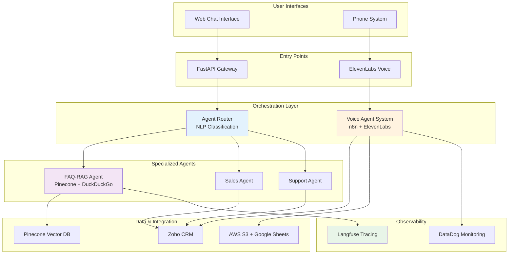
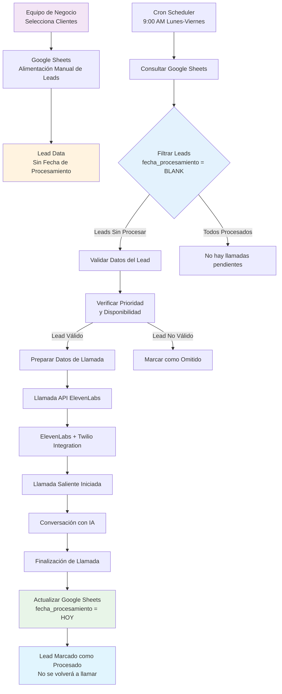
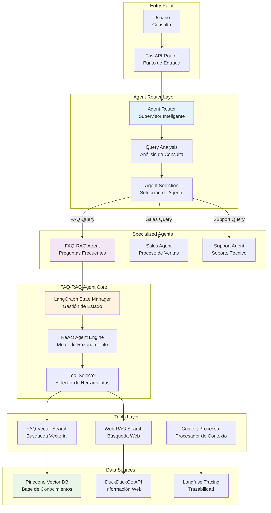
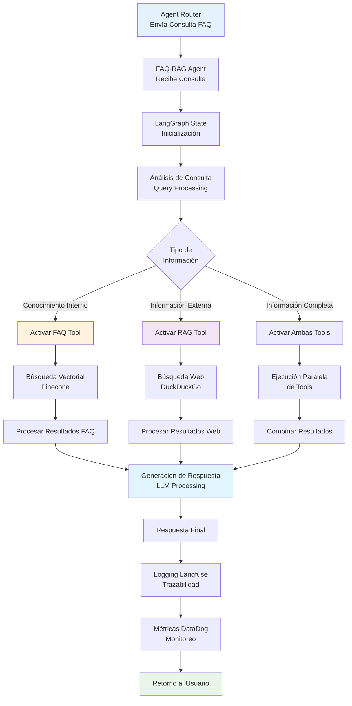
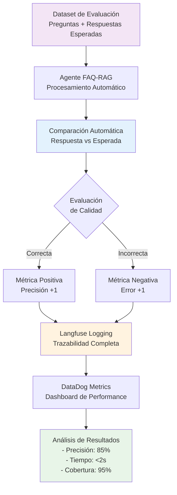

# Diagramas de Arquitectura - Sistemas de Agentes IA

## 🏗️ Vista General del Ecosistema

### 1. Arquitectura Completa del Sistema

---

## 📞 Sistema de Voz Automatizado

### 2. Flujo de Gestión de Leads y Llamadas Automatizadas

---

## 🤖 Sistema Multi-Agente FAQ-RAG

### 3. Arquitectura del Agent Router y FAQ-RAG

### 4. Flujo del FAQ-RAG Agent con Búsqueda Híbrida

---

## 📊 Observabilidad y Evaluación

### 5. Sistema de Monitoreo y Evaluación

---
