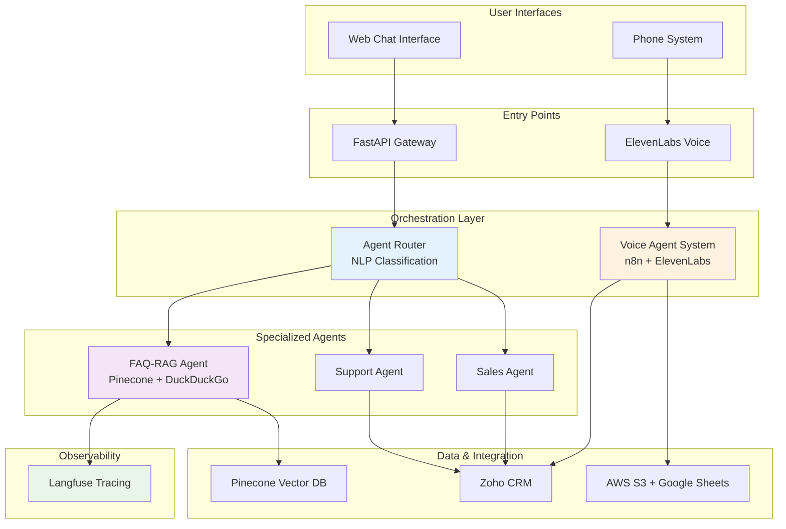

```mermaid
graph TB
    subgraph "Entry Point"
        A[Usuario<br/>Consulta]
        B[FastAPI Router<br/>Punto de Entrada]
    end
    
    subgraph "Agent Router Layer"
        C[Agent Router<br/>Supervisor Inteligente]
        D[Query Analysis<br/>Análisis de Consulta]
        E[Agent Selection<br/>Selección de Agente]
    end
    
    subgraph "Specialized Agents"
        F[FAQ-RAG Agent<br/>Preguntas Frecuentes]
        G[Sales Agent<br/>Proceso de Ventas]
        H[Support Agent<br/>Soporte Técnico]
    end
    
    subgraph "FAQ-RAG Agent Core"
        I[LangGraph State Manager<br/>Gestión de Estado]
        J[ReAct Agent Engine<br/>Motor de Razonamiento]
        K[Tool Selector<br/>Selector de Herramientas]
    end
    
    subgraph "Tools Layer"
        L[FAQ Vector Search<br/>Búsqueda Vectorial]
        M[Web RAG Search<br/>Búsqueda Web]
        N[Context Processor<br/>Procesador de Contexto]
    end
    
    subgraph "Data Sources"
        O[Pinecone Vector DB<br/>Base de Conocimientos]
        P[DuckDuckGo API<br/>Información Web]
        Q[Langfuse Tracing<br/>Trazabilidad]
    end
    
    A --> B
    B --> C
    C --> D
    D --> E
    
    E -->|FAQ Query| F
    E -->|Sales Query| G
    E -->|Support Query| H
    
    F --> I
    I --> J
    J --> K
    
    K --> L
    K --> M
    L --> O
    M --> P
    
    N --> Q
    
    style C fill:#e3f2fd
    style F fill:#f3e5f5
    style I fill:#fff3e0
    style O fill:#e8f5e8
```

```mermaid
flowchart TD
    A[Agent Router<br/>Envía Consulta FAQ] --> B[FAQ-RAG Agent<br/>Recibe Consulta]
    B --> C[LangGraph State<br/>Inicialización]
    C --> D[Análisis de Consulta<br/>Query Processing]
    
    D --> E{Tipo de<br/>Información}
    
    E -->|Conocimiento Interno| F[Activar FAQ Tool]
    E -->|Información Externa| G[Activar RAG Tool]
    E -->|Información Completa| H[Activar Ambas Tools]
    
    F --> I[Búsqueda Vectorial<br/>Pinecone]
    G --> J[Búsqueda Web<br/>DuckDuckGo]
    H --> K[Ejecución Paralela<br/>de Tools]
    
    I --> L[Procesar Resultados FAQ]
    J --> M[Procesar Resultados Web]
    K --> N[Combinar Resultados]
    
    L --> O[Generación de Respuesta<br/>LLM Processing]
    M --> O
    N --> O
    
    O --> P[Respuesta Final]
    P --> Q[Logging Langfuse<br/>Trazabilidad]
    Q --> R[Métricas DataDog<br/>Monitoreo]
    R --> S[Retorno al Usuario]
    
    style A fill:#e3f2fd
    style F fill:#fff3e0
    style G fill:#f3e5f5
    style O fill:#e1f5fe
    style S fill:#e8f5e8
```

# Diagramas de Arquitectura - Sistemas de Agentes IA

## 🏗️ Vista General del Ecosistema

### 1. Arquitectura Completa del Sistema

---

## 📞 Sistema de Voz Automatizado

### 2. Flujo de Gestión de Leads y Llamadas Automatizadas

```mermaid
flowchart TD
    A[Equipo de Negocio<br/>Selecciona Clientes] --> B[Google Sheets<br/>Alimentación Manual de Leads]
    B --> C[Lead Data<br/>Sin Fecha de Procesamiento]
    
    D[Cron Scheduler<br/>9:00 AM Lunes-Viernes] --> E[Consultar Google Sheets]
    E --> F{Filtrar Leads<br/>fecha_procesamiento = BLANK}
    
    F -->|Leads Sin Procesar| G[Validar Datos del Lead]
    F -->|Todos Procesados| H[No hay llamadas pendientes]
    
    G --> I[Verificar Prioridad<br/>y Disponibilidad]
    I -->|Lead Válido| J[Preparar Datos de Llamada]
    I -->|Lead No Válido| K[Marcar como Omitido]
    
    J --> L[Llamada API ElevenLabs]
    L --> M[ElevenLabs + Twilio Integration]
    M --> N[Llamada Saliente Iniciada]
    
    N --> O[Conversación con IA]
    O --> P[Finalización de Llamada]
    P --> Q[Actualizar Google Sheets<br/>fecha_procesamiento = HOY]
    
    Q --> R[Lead Marcado como Procesado<br/>No se volverá a llamar]
    
    style A fill:#f3e5f5
    style C fill:#fff3e0
    style F fill:#e3f2fd
    style Q fill:#e8f5e8
    style R fill:#e1f5fe
```

### 3. Flujo de Datos Completo del Sistema de Voz

---

## 🤖 Sistema Multi-Agente FAQ-RAG

### 4. Arquitectura del Agent Router y FAQ-RAG

### 5. Flujo del FAQ-RAG Agent con Búsqueda Híbrida

---

