Sistemas de Agentes IA

## Sistema de Agente de Voz Automatizado

### 1. Arquitectura Completa del Sistema de Voz

```mermaid
graph TB
    subgraph "Scheduling Layer"
        A[Cron Jobs<br/>Programación Automática]
    end
    
    subgraph "Communication Layer"
        D[ElevenLabs Voice Agent<br/>IA Conversacional + Webhooks]
        E[Twilio<br/>Proveedor de Números Telefónicos]
        F[Real-time Audio Processing<br/>Procesamiento de Audio]
    end
    
    subgraph "Integration Layer (n8n)"
        G[CRM Tool Webhook<br/>Herramienta CRM]
        H[Data Transformation<br/>Transformación de Datos]
        I[Post-Call Processing<br/>Post-procesamiento]
    end
    
    subgraph "Data Layer"
        J[Google Sheets<br/>Leads + Control de Procesamiento]
        K[Zoho CRM<br/>Actualización de Leads]
        L[AWS S3<br/>Almacenamiento de Audio]
    end
    
    subgraph "Monitoring Layer"
        M[Agent Evaluation<br/>Evaluación con Datasets]
        N[Error Logging<br/>Registro de Errores]
    end
    
    A --> D
    D --> G
    E --> F
    G --> H
    H --> K
    I --> L
    F --> I
    
    J --> A
    K --> M
    L --> N
    
    style D fill:#e3f2fd
    style G fill:#f3e5f5
    style K fill:#fff3e0
    style L fill:#e8f5e8
```

### 2. Scheduling Layer - Solo Cron Jobs

```mermaid
flowchart TD
    subgraph "CRON JOBS - Programación Automática"
        A[Cron Expression: 0 9 * * 1-5<br/>Significa: 9:00 AM, Lunes a Viernes]
        B[Servidor n8n<br/>Ejecuta automáticamente]
        C[Trigger Workflow<br/>Inicia proceso de llamadas]
        D[Leer Google Sheets<br/>Leads con fecha_procesamiento = BLANK]
        E[Iniciar llamadas<br/>Una por una, secuencialmente]
    end
    
    A --> B
    B --> C
    C --> D
    D --> E
    
    style A fill:#e3f2fd
    style C fill:#fff3e0
    style E fill:#e8f5e8
```

### 3. Programación Automática de Llamadas

```mermaid
flowchart TD
    subgraph "Programación n8n"
        A[Cron: 0 9 * * 1-5<br/>9:00 AM Lunes-Viernes]
        B[n8n Workflow Trigger<br/>Activa flujo automáticamente]
        C[Consultar Google Sheets<br/>Leads pendientes]
    end
    
    A --> B
    B --> C
    
    style A fill:#e3f2fd
    style C fill:#e8f5e8
```

### 4. Flujo de Gestión de Leads y Programación de Llamadas

```mermaid
flowchart TD
    A[Equipo de Negocio<br/>Selecciona Clientes] --> B[Google Sheets<br/>Alimentación Manual de Leads]
    B --> C[Lead Data<br/>Sin Fecha de Procesamiento]
    
    D[Cron Scheduler<br/>9:00 AM Lunes-Viernes] --> E[Consultar Google Sheets]
    E --> F{Filtrar Leads<br/>fecha_procesamiento = BLANK}
    
    F -->|Leads Sin Procesar| G[Validar Datos del Lead]
    F -->|Todos Procesados| H[No hay llamadas pendientes]
    
    G --> I[Verificar Prioridad<br/>y Disponibilidad]
    I -->|Lead Válido| J[Preparar Datos de Llamada]
    I -->|Lead No Válido| K[Marcar como Omitido]
    
    J --> L[Llamada API ElevenLabs]
    L --> M[ElevenLabs + Twilio Integration]
    M --> N[Llamada Saliente Iniciada]
    
    N --> O[Conversación con IA]
    O --> P[Finalización de Llamada]
    P --> Q[Actualizar Google Sheets<br/>fecha_procesamiento = HOY]
    
    Q --> R[Lead Marcado como Procesado<br/>No se volverá a llamar]
    
    style A fill:#f3e5f5
    style C fill:#fff3e0
    style F fill:#e3f2fd
    style Q fill:#e8f5e8
    style R fill:#e1f5fe
```

### 5. Herramienta CRM Integration (n8n Tool para ElevenLabs)

### 6. Post-Procesamiento de Llamadas (Webhook de ElevenLabs)

```mermaid
flowchart TD
    A[ElevenLabs Agent<br/>Finaliza Conversación] --> B[ElevenLabs Platform<br/>Genera Webhook Post-Call]
    B --> C[n8n Webhook Endpoint<br/>Recibe Datos de ElevenLabs]
    C --> D[Extraer Metadatos<br/>Lead ID + Call Data + Audio URL]
    
    D --> E{¿Audio URL<br/>Disponible?}
    
    E -->|Sí| F[Descargar Audio<br/>desde ElevenLabs]
    E -->|No| G[Registrar Audio<br/>No Disponible]
    
    F --> H[Subir a AWS S3<br/>Almacenamiento Seguro]
    H --> I[Generar URL Firmada<br/>Acceso Controlado]
    
    G --> J[Procesar Transcripción<br/>Texto de ElevenLabs]
    I --> J
    J --> K[Extraer Métricas de Calidad<br/>Datos de ElevenLabs]
    
    K --> L[Actualizar Google Sheets<br/>Log de Llamadas Detallado]
    L --> M[Marcar Lead como Procesado<br/>fecha_procesamiento = FECHA_ACTUAL]
    
    M --> N{¿Llamada<br/>Exitosa?}
    N -->|Sí| O[Lead Procesado Exitosamente<br/>Estado: CONTACTADO]
    N -->|No| P[Lead con Error<br/>Pero Fecha Actualizada]
    
    O --> Q[Enviar Notificación<br/>de Éxito]
    P --> R[Enviar Alerta<br/>de Error]
    
    style B fill:#f3e5f5
    style F fill:#fff3e0
    style L fill:#e8f5e8
    style O fill:#e1f5fe
```

### 7. Flujo de Datos Completo del Sistema de Voz

```mermaid
sequenceDiagram
    participant BIZ as Equipo de Negocio
    participant GS as Google Sheets
    participant CRON as Cron Scheduler
    participant EL as ElevenLabs Agent
    participant TW as Twilio (Números)
    participant N8N as n8n Webhooks
    participant ZOHO as Zoho CRM
    participant S3 as AWS S3
    
    Note over BIZ,GS: Alimentación inicial de leads
    BIZ->>GS: Agregar nuevos leads (fecha_procesamiento = BLANK)
    
    Note over CRON,GS: Procesamiento automático diario
    CRON->>GS: Consultar leads con fecha_procesamiento = BLANK
    GS-->>CRON: Lista de leads sin procesar
    
    alt Hay leads pendientes
        CRON->>EL: Iniciar llamada automática
        EL->>TW: Usar número Twilio para llamada
        TW-->>EL: Número disponible
        
        Note over EL: ElevenLabs maneja toda la conversación
        
        EL->>N8N: Tool call - Actualizar CRM
        N8N->>ZOHO: Actualizar información del lead
        ZOHO-->>N8N: Confirmación de actualización
        N8N-->>EL: Respuesta del tool
        
        EL->>N8N: Webhook post-llamada (con audio URL y transcripción)
        N8N->>S3: Descargar y almacenar audio desde ElevenLabs
        S3-->>N8N: URL de archivo almacenado en S3
        N8N->>GS: Actualizar fecha_procesamiento = HOY + datos de llamada
        GS-->>N8N: Lead marcado como procesado
        
        Note over GS: Lead no volverá a ser llamado
    else No hay leads pendientes
        CRON->>CRON: Esperar próxima ejecución
    end
```

---

## 🤖 Sistema Multi-Agente FAQ-RAG con Router

### 6. Arquitectura del Sistema Multi-Agente con Router

```mermaid
graph TB
    subgraph "Entry Point"
        A[Usuario<br/>Consulta]
        B[FastAPI Router<br/>Punto de Entrada]
    end
    
    subgraph "Agent Router Layer"
        C[Agent Router<br/>Supervisor Inteligente]
        D[Query Analysis<br/>Análisis de Consulta]
        E[Agent Selection<br/>Selección de Agente]
    end
    
    subgraph "Specialized Agents"
        F[FAQ-RAG Agent<br/>Preguntas Frecuentes]
        G[Sales Agent<br/>Proceso de Ventas]
        H[Support Agent<br/>Soporte Técnico]
    end
    
    subgraph "FAQ-RAG Agent Core"
        I[LangGraph State Manager<br/>Gestión de Estado]
        J[ReAct Agent Engine<br/>Motor de Razonamiento]
        K[Tool Selector<br/>Selector de Herramientas]
    end
    
    subgraph "Tools Layer"
        L[FAQ Vector Search<br/>Búsqueda Vectorial]
        M[Web RAG Search<br/>Búsqueda Web]
        N[Context Processor<br/>Procesador de Contexto]
    end
    
    subgraph "Data Sources"
        O[Pinecone Vector DB<br/>Base de Conocimientos]
        P[DuckDuckGo API<br/>Información Web]
        Q[Langfuse Tracing<br/>Trazabilidad]
    end
    
    A --> B
    B --> C
    C --> D
    D --> E
    
    E -->|FAQ Query| F
    E -->|Sales Query| G
    E -->|Support Query| H
    
    F --> I
    I --> J
    J --> K
    
    K --> L
    K --> M
    L --> O
    M --> P
    
    N --> Q
    
    style C fill:#e3f2fd
    style F fill:#f3e5f5
    style I fill:#fff3e0
    style O fill:#e8f5e8
```

### 7. Flujo de Decisión del Agent Router

```mermaid
flowchart TD
    A[Consulta del Usuario] --> B[Agent Router<br/>Recibe Consulta]
    B --> C[Análisis de Intención<br/>NLP Processing]
    
    C --> D{Clasificación<br/>de Consulta}
    
    D -->|FAQ/Información| E[Activar FAQ-RAG Agent]
    D -->|Ventas/Comercial| F[Activar Sales Agent]
    D -->|Soporte Técnico| G[Activar Support Agent]
    D -->|Consulta Compleja| H[Multi-Agent Coordination]
    
    E --> I[FAQ-RAG Agent<br/>Procesamiento]
    F --> J[Sales Agent<br/>Procesamiento]
    G --> K[Support Agent<br/>Procesamiento]
    H --> L[Coordinación Multi-Agente]
    
    I --> M[Respuesta FAQ]
    J --> N[Respuesta Ventas]
    K --> O[Respuesta Soporte]
    L --> P[Respuesta Coordinada]
    
    M --> Q[Entrega al Usuario]
    N --> Q
    O --> Q
    P --> Q
    
    style B fill:#e3f2fd
    style C fill:#fff3e0
    style E fill:#f3e5f5
    style Q fill:#e8f5e8
```

### 8. Flujo Detallado del FAQ-RAG Agent

```mermaid
flowchart TD
    A[Agent Router<br/>Envía Consulta FAQ] --> B[FAQ-RAG Agent<br/>Recibe Consulta]
    B --> C[LangGraph State<br/>Inicialización]
    C --> D[Análisis de Consulta<br/>Query Processing]
    
    D --> E{Tipo de<br/>Información}
    
    E -->|Conocimiento Interno| F[Activar FAQ Tool]
    E -->|Información Externa| G[Activar RAG Tool]
    E -->|Información Completa| H[Activar Ambas Tools]
    
    F --> I[Búsqueda Vectorial<br/>Pinecone]
    G --> J[Búsqueda Web<br/>DuckDuckGo]
    H --> K[Ejecución Paralela<br/>de Tools]
    
    I --> L[Procesar Resultados FAQ]
    J --> M[Procesar Resultados Web]
    K --> N[Combinar Resultados]
    
    L --> O[Generación de Respuesta<br/>LLM Processing]
    M --> O
    N --> O
    
    O --> P[Respuesta Final]
    P --> Q[Logging Langfuse<br/>Trazabilidad]
    Q --> R[Métricas DataDog<br/>Monitoreo]
    R --> S[Retorno al Usuario]
    
    style A fill:#e3f2fd
    style F fill:#fff3e0
    style G fill:#f3e5f5
    style O fill:#e1f5fe
    style S fill:#e8f5e8
```

### 9. Base de Conocimiento Vectorial (Pinecone) - Explicación Detallada

### 10. Flujo Detallado de la Búsqueda Vectorial

```mermaid
sequenceDiagram
    participant USER as Usuario
    participant AGENT as FAQ-RAG Agent
    participant EMB as Embedding Service
    participant PINE as Pinecone DB
    participant LLM as Gemini LLM
    
    USER->>AGENT: "¿Cuál es el proceso de compra?"
    
    Note over AGENT,EMB: Conversión de texto a vector
    AGENT->>EMB: Convertir pregunta a embedding
    EMB-->>AGENT: Vector [0.1, -0.3, 0.8, ...]
    
    Note over AGENT,PINE: Búsqueda de similitud
    AGENT->>PINE: Buscar vectores similares (top_k=10)
    PINE-->>AGENT: Documentos relevantes + scores
    
    Note over AGENT: Ejemplo de respuesta de Pinecone:
    Note over AGENT: [{"id": "doc_123", "score": 0.95,<br/>"metadata": {"text": "El proceso de compra...",<br/>"source": "manual_ventas.pdf"}}]
    
    Note over AGENT,LLM: Generación de respuesta
    AGENT->>LLM: Contexto + Pregunta + Documentos encontrados
    LLM-->>AGENT: Respuesta basada en conocimiento
    AGENT-->>USER: Respuesta final contextualizada
```

### 11. Arquitectura de Capas del FAQ-RAG Agent

```mermaid
graph TB
    subgraph "Presentation Layer"
        A[Agent Router Interface<br/>Interfaz de Router]
        B[Request Validation<br/>Validación de Entrada]
        C[Response Formatting<br/>Formato de Respuesta]
    end
    
    subgraph "Business Logic Layer"
        D[FAQ-RAG Controller<br/>Controlador Principal]
        E[Service Orchestration<br/>Orquestación de Servicios]
        F[Business Rules<br/>Reglas de Negocio]
    end
    
    subgraph "Agent Core Layer"
        G[LangGraph State Manager<br/>Gestor de Estado]
        H[ReAct Agent Engine<br/>Motor ReAct]
        I[Tool Selector<br/>Selector de Herramientas]
    end
    
    subgraph "Tools Layer"
        J[FAQ Vector Search<br/>Búsqueda FAQ]
        K[Web RAG Search<br/>Búsqueda RAG]
        L[Context Processor<br/>Procesador de Contexto]
    end
    
    subgraph "Infrastructure Layer"
        M[Pinecone Vector DB<br/>Base Vectorial]
        N[DuckDuckGo API<br/>API de Búsqueda]
        O[Langfuse Tracing<br/>Trazabilidad]
        P[DataDog Monitoring<br/>Monitoreo]
    end
    
    A --> D
    B --> E
    D --> G
    E --> H
    H --> I
    I --> J
    I --> K
    J --> M
    K --> N
    G --> O
    H --> P
    C --> A
    
    style D fill:#e3f2fd
    style H fill:#f3e5f5
    style J fill:#fff3e0
    style M fill:#e8f5e8
```

---

## 📊 Observabilidad y Monitoreo del Sistema Completo

### 12. Flujo de Trazabilidad Unificado

### 13. Vista General del Ecosistema Completo

---

